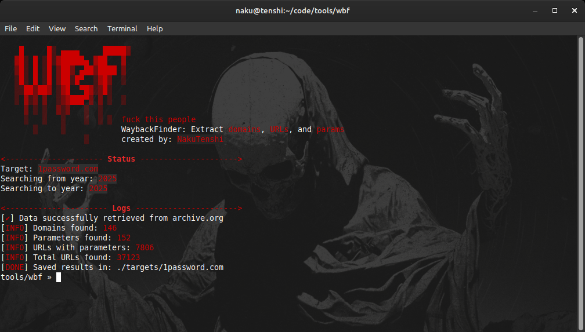

# WaybackFinder (WBF)

<div align="center">
  
  <p>WaybackFinder – Gather domains, URLs, and parameters from archive.org snapshots.</p>
</div>

---



**WaybackFinder** is a Python tool for extracting **domains**, **URLs**, and **parameters** from the [Wayback Machine](https://archive.org/).  
It helps bug bounty hunters, penetration testers, and security researchers to gather historical data about a target domain.

## Features

- Extract all unique **domains** found in the Wayback Machine for a given target.
- Extract **URLs** and **parameters** from archived snapshots.
- Save results in organized text files:
  - `domains.txt`
  - `params.txt`
  - `url_params.txt`
  - `all_urls.txt`
- Supports filtering by **year range**.
- Colorful and clear terminal output with logs.
- Minimal memory usage: processes URLs line by line.

## Installation

Clone the repository and Install required dependencies:
```bash
git clone https://github.com/yourusername/WaybackFinder.git
cd WaybackFinder
pip3 install requirements.txt
```

## Usage

```bash
python wbf.py -d example.com --from-year 2020 --to-year 2023 
```
### Argument

| Argument       | Description                     | Required |
|----------------|---------------------------------|----------|
| `-d`           | Target domain (example: site.tld) | Yes      |
| `--from-year`  | Start year for the archive search | No       |
| `--to-year`    | End year for the archive search   | No       |
| `--no-timeline`| Ignores the timeline's fillter    | No       |


---

Created By: **Naku Tenshi**
